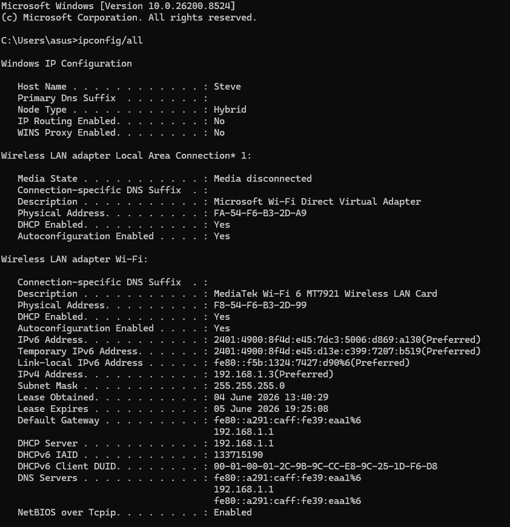
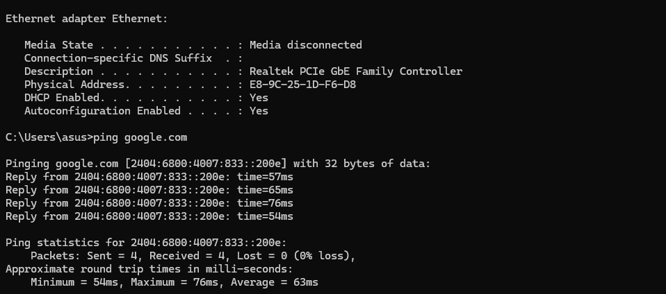
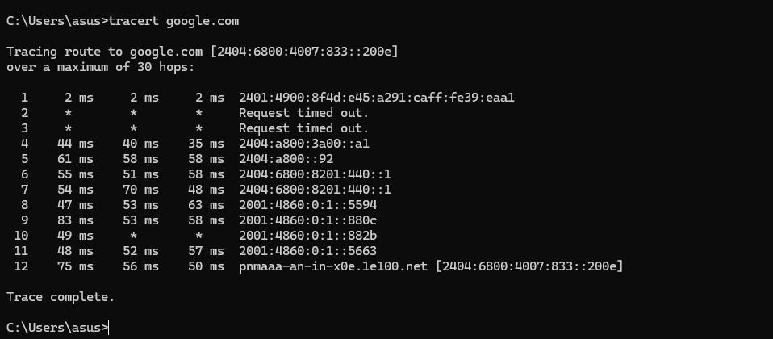

** Networking Task 01: Understanding Your Network Environment**

## Student Information

**Name:** Stephen J
**Date:** June 2026

---

# Objective

The purpose of this task is to understand the basic components of a network and identify the network configuration of my system.

---

# Part A: Network Information

## Device Details

| Parameter       | Value             |
| --------------- | ----------------- |
| Hostname        | Steve             |
| IPv4 Address    | 192.168.1.3       |
| MAC Address     | F8-54-F6-B3-2D-99 |
| Default Gateway | 192.168.1.1       |
| DNS Server      | 192.168.1.1       |

### Screenshots Included

* ipconfig /all output
* ping google.com output
* tracert google.com output

---

# Part B: Basic Networking Concepts

## What is an IP Address?

An IP Address (Internet Protocol Address) is a unique address assigned to a device on a network. It allows devices to communicate and exchange data with each other.

## What is a MAC Address?

A MAC Address (Media Access Control Address) is a unique hardware identifier assigned to a network interface card by the manufacturer.

## What is a Default Gateway?

A Default Gateway is the router that connects a local network to external networks such as the Internet. It acts as the exit point for network traffic.

## What is DNS?

DNS (Domain Name System) translates domain names such as google.com into IP addresses that computers use to locate servers on the Internet.

## Difference Between Public IP and Private IP

| Public IP            | Private IP                          |
| -------------------- | ----------------------------------- |
| Used on the Internet | Used inside local networks          |
| Assigned by ISP      | Assigned by Router                  |
| Globally unique      | Can be reused in different networks |
| Example: 49.x.x.x    | Example: 192.168.x.x                |

---

# Part C: Basic Network Diagram

```text
Internet
    │
    ▼
Wi-Fi Router
(192.168.1.1)
    │
    ▼
Laptop
(192.168.1.3)
```

A network diagram image is included in the repository.

---

# Part D: Network Connectivity Test

## Commands Used

```cmd
ipconfig /all
ping google.com
tracert google.com
```

## Ping Test Result

### Was the ping successful?

Yes. The ping test was successful.

### Ping Statistics

* Packets Sent: 4
* Packets Received: 4
* Packets Lost: 0
* Average Response Time: 63 ms


## Traceroute Result

### How many hops were shown?

12 hops were displayed before reaching Google.

### What is the purpose of traceroute?

Traceroute identifies the path taken by data packets from the source device to the destination server. It helps diagnose network delays and connectivity problems.

---

# Screenshots Included

ipconfig_all.png



ping_google.png



tracert_google.png




---

# Learning Outcomes

Through this task, I learned:

* Network configuration basics
* IPv4 and IPv6 addressing
* MAC Address identification
* DNS functionality
* Role of Default Gateway
* Network connectivity testing
* Using ping command
* Using traceroute command
* Understanding packet routing on the Internet

---

# Conclusion

This task provided hands-on experience in identifying network settings and testing Internet connectivity. I learned how devices communicate within a network and how data travels through multiple routers before reaching a destination server.

---

# Repository Structure

```text
Networking_Task_01_Stephen
│
├── README.md
│
├── Screenshots
│   ├── ipconfig_all.png
│   ├── ping_google.png
│   └── tracert_google.png
│
├── Network_Diagram
│   └── network_diagram.png
│
├── Answers
│   └── answers.txt
│
└── Command_Outputs
    └── outputs.txt
```
